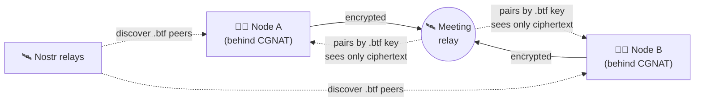

<div align="center">


# Bitflash ⚡ &nbsp;`BTF`

### Satoshi's Bitcoin, reborn — mine with your **CPU**, stay **invisible**, run **anywhere**.

A faithful revival of the original 2009 `bitcoin-0.1.0`, rebuilt for today:
**memory-hard CPU mining** that shuts out ASICs and GPUs, **anonymous addressing**
that hides your IP and punches through CGNAT, and a **fair launch** with no premine.

<br/>

-2ea44f?style=for-the-badge)


**[⬇️ Download for Windows](../../releases/latest)** &nbsp;·&nbsp; **[🐧 Build for Linux](#-linux-node--miner)** &nbsp;·&nbsp; **[🧠 How it works](#-how-it-works)**

</div>

---

## 💡 One CPU, one vote

Bitcoin promised money mined by anyone with a computer. Then ASIC farms and mining
pools took over, and "anyone" became "whoever owns a warehouse." Bitflash gives that
promise back.

- 🧩 **Memory-hard proof of work (RandomX).** The same algorithm Monero uses to keep
  mining on ordinary CPUs. No ASICs. No GPU farms. Your laptop competes on equal footing.
- 🕶️ **Anonymous by default.** Your node is reachable by a self-certifying `.btf`
  address instead of an IP — a Tor-style hidden service built into the coin, over
  [Nostr](https://nostr.com). Peers never see your IP.
- 🌐 **Works behind any firewall.** No public IP? Stuck behind CGNAT? No port
  forwarding? Doesn't matter. Nodes rendezvous through a lightweight relay and connect
  anyway.
- ⚖️ **Fair launch.** No premine. No ICO. No founder's reward. The genesis block mints
  the same 50 coins everyone else mines for.
- 🪙 **Sound money.** 50 BTF per block, halving on schedule, hard cap of **21,000,000** —
  exactly like the original.

---

## ✨ Features

| | |
|---|---|
| 🧠 **RandomX PoW** | CPU-only, ASIC/GPU-resistant mining — one CPU, one vote |
| 🔐 **`.btf` hidden addresses** | Self-certifying, unforgeable node identity; your IP is never exposed |
| 🛰️ **Nostr peer discovery** | No central servers, no DNS seeds — nodes find each other over open relays |
| 🚪 **CGNAT traversal** | Rendezvous transport lets nodes behind carrier NAT reach each other |
| 🔒 **End-to-end encrypted P2P** | X25519 + XChaCha20-Poly1305 channel; the relay only ever sees ciphertext |
| 💸 **Instant transfers** | Send coins peer-to-peer in under a second |
| 🖥️ **Retro wallet** | The classic, no-nonsense Bitcoin 0.1.0 interface, one "Generate Coins" click away |
| 🐧 **Windows & Linux** | GUI wallet on Windows, headless daemon for Linux servers |

---

## 🚀 Quick start

### 🪟 Windows (GUI wallet + miner)

1. **[Download the latest release](../../releases/latest)** and unzip it anywhere.
2. Double-click **`bitflash.exe`**.
3. Wait ~1 minute — it finds peers on its own and starts syncing.
4. **Options → Generate Coins** to start mining with your CPU. That's it. 🎉

No install, no config, no command line. It connects automatically, even behind CGNAT.

### 🐧 Linux (node + miner)

```bash
# grab the source, then:
bash build-linux.sh          # installs deps, builds secp256k1 + RandomX + the node
./src/bitflash-node -gen      # run + mine (auto-discovers peers, no config needed)
```

Run it 24/7 as a service — see [`docs/`](docs) and the systemd snippet below.

---

## 🧠 How it works

Bitflash keeps Satoshi's consensus intact and swaps two things: **the proof of work**
and **how nodes find and reach each other**.

### Anonymous rendezvous (the `.btf` network)

Every node has a `.btf` address derived from its public key — like a Tor `.onion`, but
built into the coin. Nodes publish a signed descriptor over Nostr, and connect through a
meeting relay so **neither side ever learns the other's IP**, and **no port forwarding is
ever needed**.



The relay is dumb on purpose: it pairs peers by their `.btf` key and forwards bytes. The
real connection is end-to-end encrypted (X25519 + XChaCha20-Poly1305) and authenticated
to each peer's static key, so a malicious relay can't read or tamper — it can only refuse.

### RandomX proof of work

Blocks are mined with **RandomX**, a memory-hard algorithm that runs efficiently on
general-purpose CPUs and terribly on specialized hardware. This is what keeps mining
decentralized: no ASIC advantage, no GPU farms — just CPUs, one vote each.

---

## 🛠️ Build from source

### Linux

```bash
bash build-linux.sh
```

Installs `build-essential cmake libssl-dev libdb5.3++-dev libsodium-dev
nlohmann-json3-dev libboost-dev`, builds `libsecp256k1` (Schnorr) and `RandomX` from
source, then the `bitflash-node` binary. Debian/Ubuntu.

### Windows

Built with **MSYS2 UCRT64** (g++ 16, wxWidgets 3.2, OpenSSL 3, Berkeley DB). See
[`build.sh`](build.sh) and `src/makefile.mingw`.

### Run a rendezvous relay (optional, help the network)

Have a box with a public IP? Run a relay in one command and strengthen the network:

```bash
sudo bash relay/install-bitflash-relay.sh 8434
```

It builds a tiny, dependency-free daemon and installs it as a systemd service.

<details>
<summary>Run the Linux node 24/7 (systemd)</summary>

```ini
# /etc/systemd/system/bitflash-node.service
[Unit]
Description=Bitflash node/miner
After=network.target

[Service]
WorkingDirectory=/root/bitflash/src
ExecStart=/root/bitflash/src/bitflash-node -gen
Restart=always
User=root

[Install]
WantedBy=multi-user.target
```
```bash
systemctl daemon-reload && systemctl enable --now bitflash-node
```
</details>

---

## 📊 At a glance

| Parameter | Value |
|---|---|
| Ticker | **BTF** |
| Proof of work | RandomX (CPU, memory-hard) |
| Block reward | 50 BTF, halving on schedule |
| Max supply | 21,000,000 BTF |
| Target block time | ~2 minutes |
| Address privacy | `.btf` hidden-service addressing over Nostr |
| Premine / ICO | **None** |
| Platforms | Windows (GUI), Linux (headless) |

---

## 🗺️ Roadmap

- [x] Faithful port of `bitcoin-0.1.0` to a modern toolchain
- [x] RandomX CPU proof of work
- [x] Nostr peer discovery (replacing IRC)
- [x] `.btf` anonymous addressing + CGNAT rendezvous
- [x] Automatic peer discovery — zero config
- [x] Headless Linux node/miner
- [x] Fair-launch, stable-parameter relaunch
- [ ] Optional direct IPv6 transport (opt-in, for public backbone nodes)
- [ ] Redundant relays & bootstrap hardening
- [ ] One-click installers

---

## ⚠️ Disclaimer

Bitflash is **experimental software**, released in the spirit of the original Bitcoin:
*"This is a design and prototype. Use at your own risk. It comes with no warranty of any
kind."* It has real cryptography and a live network, but it is young. Don't put in more
than you're willing to lose, and don't rely on it for anything critical.

---

## 📜 License

MIT — see [LICENSE](LICENSE). Built on Satoshi Nakamoto's original Bitcoin (2009),
extended by the Bitflash developers (2026).

<div align="center">
<br/>
<b>⚡ One CPU. One vote. Mining returns to the people. ⚡</b>
</div>
