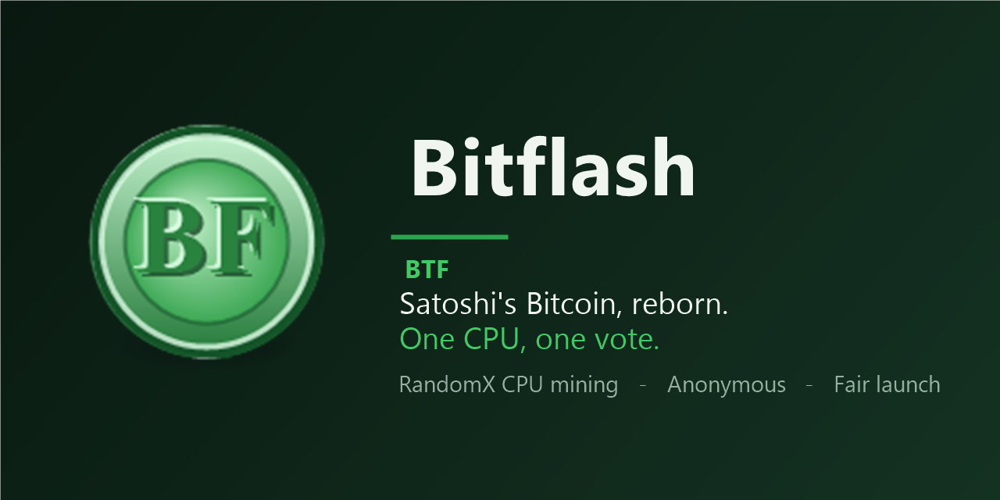

<div align="center">



# Bitflash `BTF`

CPU-only cryptocurrency. A revival of Bitcoin 0.1.0 with RandomX proof of work and anonymous `.btf` addressing over Nostr.

-2ea44f?style=for-the-badge)


**[Download](../../releases/latest)**

</div>

---

## What it is

Bitflash keeps Satoshi's original consensus rules and replaces two things:

**RandomX proof of work.** Memory-hard algorithm used by Monero. A laptop competes equally with a server. ASICs and GPUs have no advantage.

**Anonymous addressing.** Every node has a `.btf` address derived from its public key, similar to a Tor `.onion`. Nodes find each other through Nostr relays and connect via encrypted rendezvous tunnels. Your IP is never exposed to other nodes, and no port forwarding is needed.

No premine. No ICO. 50 BTF per block, halving on schedule, 21M cap, ~2 minute blocks.

---

## Quick start

Download the latest release and run. No install, no configuration — it connects automatically and starts syncing.

**Linux:** `Bitflash-1.1.0-x86_64.AppImage` — make executable and run.

**Windows:** Extract `Bitflash-1.1.0-windows.zip` and run `Bitflash.exe`.

---

## Mining

Open **Options** from the menu bar. Under Mining Mode:

**Solo** — mine directly to your wallet. Default.

**Operator** — run a pool. The pool server uses `.btf` rendezvous only. The window shows the pool's `.btf` address, discovered pools, and owed payouts.

Pool announcements are published on Nostr with live status fields, so external tools can query the latest pool state by `.btf` address.

**Participant** — mine to someone else's pool. Enter or select the pool's `.btf` address and enable Start Mining.

SRBMiner and XMRig connect to operator pools through the `.btf` path:

```bash
SRBMiner-MULTI --algorithm randomx --pool POOL_BTF_ADDRESS --wallet YOUR_BTF_ADDRESS --password x
xmrig -a rx/0 -o POOL_BTF_ADDRESS -u YOUR_BTF_ADDRESS -p x
```

---

## Headless / server mode

```bash
./bitflash /nogui                     # node only
./bitflash /nogui /gen /operator      # pool operator
./bitflash /nogui /gen /participant=POOL_BTF_ADDRESS  # mine to pool
```

As a systemd service:

```ini
[Unit]
Description=Bitflash node
After=network.target

[Service]
ExecStart=/opt/bitflash/bitflash /nogui /gen /operator
Restart=always
User=bitcoin
WorkingDirectory=/opt/bitflash

[Install]
WantedBy=multi-user.target
```

---

## Running a relay

Relays are the meeting points that let nodes behind NAT connect to each other. More relays make the network more resilient.

```bash
sudo bash relay/install-bitflash-relay.sh 8434
./bitflash /nogui /announcerelay=YOUR_PUBLIC_IP:8434
```

Relays forward encrypted bytes and cannot read or modify traffic.

---

## Build from source

**Linux:**
```bash
make linux
```
Installs deps via apt, builds libsecp256k1 and RandomX, produces `Bitflash-*.AppImage`.

**Windows (MSYS2 UCRT64):**
```bash
make windows
```
Installs deps via pacman, produces `Bitflash-*-windows.zip`.

---

## At a glance

| | |
|---|---|
| Ticker | BTF |
| Proof of work | RandomX (CPU, memory-hard) |
| Block reward | 50 BTF, halving on schedule |
| Max supply | 21,000,000 BTF |
| Block time | ~2 minutes |
| Privacy | `.btf` hidden-service addressing over Nostr |
| Premine | None |
| Pool server | Built-in — `.btf` rendezvous only |

---

Experimental software. Young network. Don't put in more than you are willing to lose.

MIT. Built on Bitcoin 0.1.0 (Satoshi Nakamoto, 2009).
